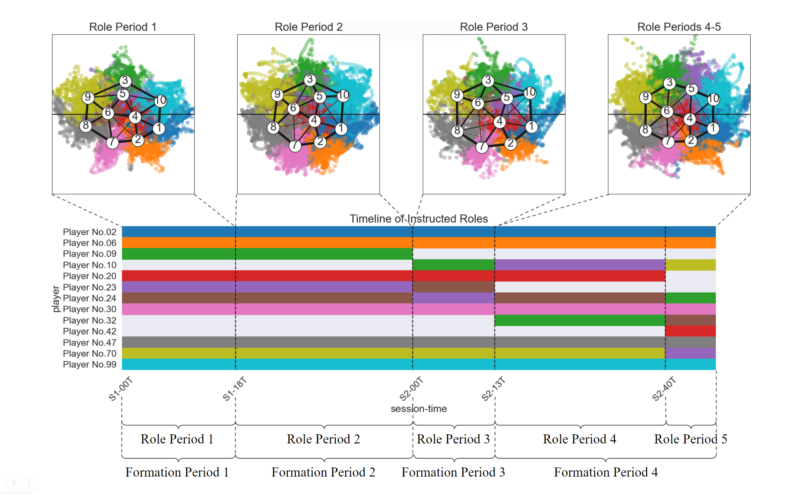

<div align="center">
	<h1>
		SoccerCPD
	</h1>
</div>

## Original Paper
This repository includes the source code for the following paper and tracking data from a sample match (`17985.ugp`). Please cite when using our code or the sample match data.
- H. Kim, B. Kim, D. Chung, J. Yoon and S.-K. Ko, **SoccerCPD: Formation and role change-point detection in soccer matches from spatiotemporal tracking data**, ACM SIGKDD Conference on Knowledge Discovery and Data Mining, 2022, DOI: https://dl.acm.org/doi/10.1145/3534678.3539150.

## Introduction
**SoccerCPD** is a change-point detection framework that distinguishes tactically intended formation and role changes from temporary changes in football matches using spatiotemporal tracking data.<br>
It first assigns roles to players frame-by-frame based on the role representation (Bialkowski et al., 2014) and performs two-step nonparametric change-point detections (Song and Chen, 2020): (1) formation change-point detection (FormCPD) based on the sequence of role-adjacency matrices and (2) role change-point detection (RoleCPD) based on the sequence of role permutations.<br>

Here is an example of applying SoccerCPD to a match. It shows that the match is split into four formation periods (where the team formation is consistent) and five role periods (where the player-role assignment remains constant).<br>

<br>

We cannot share the entire dataset due to the security issue, but every process except for the formation clustering can be reproduced using the sample match data (`17985.ugp`) since applying our method to a match does not require data from other matches. For the formation clustering (Section 4.3) and role labeling (Section 5.3) steps of the paper, we offer `data/form_periods.pkl`, `data/role_periods.csv`, and `data/role_records.csv` that contains the information of all the detected formations and roles in our dataset.<br>

## Getting Started
We have implemented the role representation algorithm using Python on our own, while adopted the R package `gSeg` for discrete g-segmentation. Therefore, **both Python and R need to be installed for executing the code.** The version we have used in this study are as follows:

- Python 3.8
- R 3.6.0

To perform the whole process at once, we utilize the Python package `rpy2` to run the R script with  `gSeg` inside our Python implementation. We found that **the M1 chip by Apple does not support binaries for `rpy2`'s API mode in Python, raising a memory error.** (So please use another processor such as the Intel chip.)

After installing the necessary languages, you need to install the packages listed in `requirements.txt`. Make sure that you are in the correct working directory that contains our `requirements.txt`.
```
pip install -r requirements.txt
```

Subsequently, please download the sample match data (named `17985.ugp`) from the following Google Drive link and move it into the directory `data/ugp`.
- Link for the data: https://bit.ly/3gHhkHG

Finally, you can run the algorithm for the sample match data simply by executing `main.py`.
```
python -m main
```

For further analyses, open `tutorial.ipynb` and run the cells in order from the above. (Section 4.1, 4.2, 5.1, and 5.2)

You can also reproduce the results described in the paper by executing the following notebooks:

- `notebooks/1_formaiont_clustering.ipynb` (Section 4.3)
- `notebooks/2_role_labeling.ipynb` (Section 5.3)
- `notebooks/3_model_evaluation.ipynb` (Section 6.1)
- `notebooks/5_switching_pattern_discovery.ipynb` (Section 6.2)<br>

Lastly, we visualize our results as animations using Tableau 2020.4. The full-version video is available in https://www.youtube.com/watch?v=F-tvG1-MLps with the description in Appendix C of the paper.<br>

## References
- A. Bialkowski, P. Lucey, P. Carr, Y. Yue, S. Sridharan and I. Matthews, Large-Scale Analysis of Soccer Matches Using Spatiotemporal Tracking Data, IEEE International Conference on Data Mining, 2014, DOI: https://doi.org/10.1109/ICDM.2014.133.
- H. Song and H. Chen, Asymptotic distribution-free changepoint detection for data with repeated observations, Biometrika, 2021, asab048, DOI: https://doi.org/10.1093/biomet/asab048.
